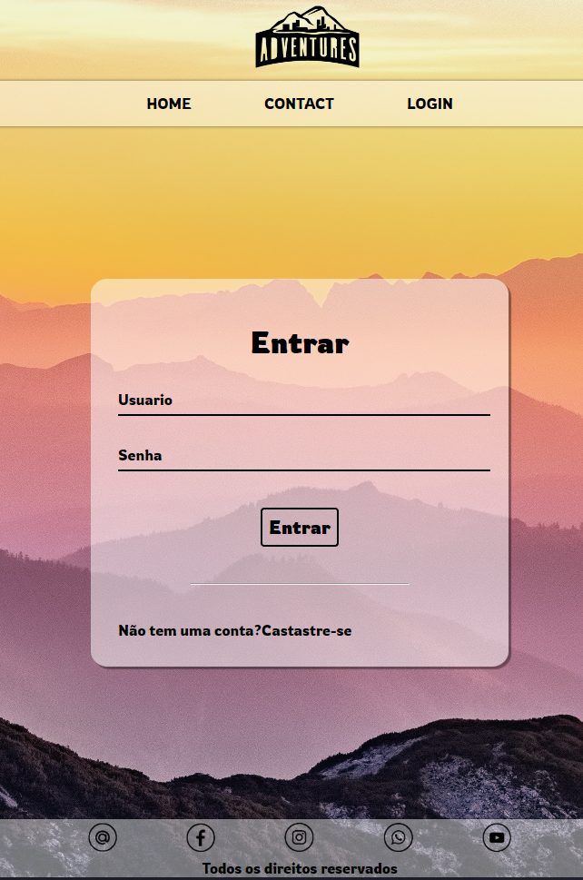
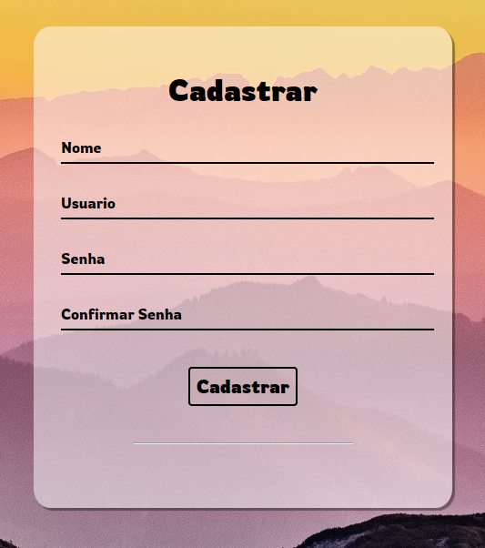
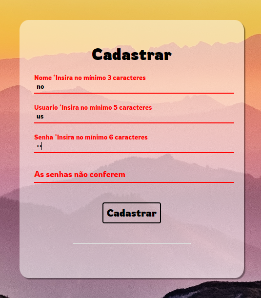
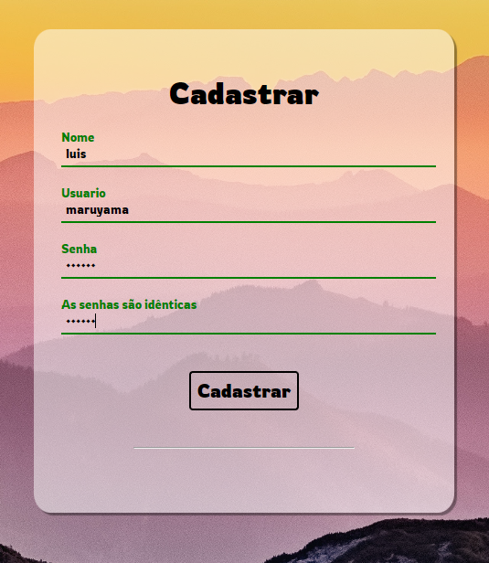

## Sobre o projeto
 Criei um site web one page com React onde é possível fazer cadastro e login de usuário, e usei o localStorage para armazenar os dados salvos e depois fazer a autenticação do novo usuário.

## Objetivo do projeto
-Neste projeto meu objetivo foi avançar um pouco mais nos estudos de back end com o desenvolvimento de lógica usando javascript e banco de dados

-Aprender e praticar o desenvolvimento de códigos para validação de formularios inderidos pelo usuário

-Aprender e praticar criação e manipulação de banco de dados.

## Deploy
Você pode usar o aplicativo no seu navegador clicando nas imagens abaixo:

 

 
Imagem da tela de login
 

 

 
Imagem da tela de cadastro
 

 

 
Imagem da tela - validação de formulário
 

 

 
Imagem da tela - validação de formulário
 

 

 
Imagem da tela página do perfil usuário após cadastro ser realizado com uso do banco de dados local.
 

 

## Tecnologias
O projeto foi desenvolvido usando apenas HTML, CSS, JAVASCRIPT e REACT

 

